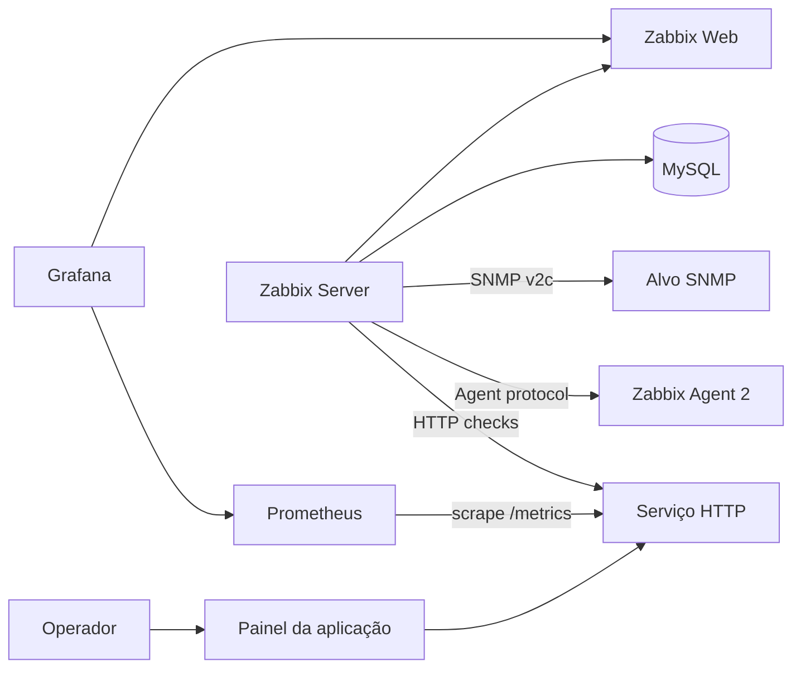

# Observability Lab

Projeto de portfólio para demonstrar monitoramento, observabilidade e resposta
a incidentes em uma aplicação com falhas controladas.

## O que está funcionando

- aplicação HTTP com painel visual;
- liveness e readiness separados;
- injeção de indisponibilidade, erro HTTP e latência;
- logs estruturados em JSON;
- métricas Prometheus;
- MySQL para persistência do Zabbix;
- Zabbix Server 7.0 LTS e interface web;
- Zabbix Agent 2 com CPU e memória;
- monitoramento HTTP com triggers;
- alvo SNMP v2c com coleta de OIDs;
- Grafana com Prometheus e plugin Zabbix;
- dashboard provisionado automaticamente;
- teste automatizado de alerta e recuperação.

## Arquitetura



## Iniciar

```bash
make up
```

Na primeira execução, aguarde a inicialização do MySQL e do Zabbix. O
container `zabbix-bootstrap` configura hosts, itens, cenários web e triggers.

## Interfaces

| Interface | URL | Credenciais |
|---|---|---|
| Centro de controle | http://localhost:18080 | sem login |
| Zabbix | http://localhost:8080 | `Admin` / `zabbix` |
| Grafana | http://localhost:3000 | `admin` / valor de `GRAFANA_ADMIN_PASSWORD` |
| Prometheus | http://localhost:9090 | sem login |

As senhas deste laboratório são locais e demonstrativas. O arquivo `.env` não
deve ser versionado.

## Demonstração visual

1. Abra o centro de controle.
2. Abra `Monitoring > Problems` no Zabbix.
3. Abra o dashboard `Observability Lab - Visão Operacional` no Grafana.
4. No centro de controle, selecione um modo de falha.
5. Aguarde o intervalo de coleta do Zabbix.
6. Mostre o problema aberto, os dados e o comportamento da aplicação.
7. Clique em `Restaurar`.
8. Mostre o evento de recuperação.

### Cenários

| Modo | Efeito | Alerta esperado |
|---|---|---|
| `unhealthy` | readiness retorna 503 | aplicação indisponível |
| `error` | `/work` retorna 500 | operação principal com erro |
| `slow` | respostas atrasam 3 segundos | operação acima de 2 segundos |
| `healthy` | restaura o comportamento | trigger normalizada |

## Testes

Teste da aplicação:

```bash
make test
```

Teste completo dos incidentes:

```bash
make incidents
```

O teste ativa cada falha, espera a trigger do Zabbix e confirma a recuperação.

Verificação de itens e problemas:

```bash
make verify
```

Consulta SNMP direta:

```bash
docker compose exec snmp-target \
  snmpget -v2c -c observability 127.0.0.1:1161 \
  1.3.6.1.2.1.1.5.0
```

## Operação

```bash
make status
make logs
make down
```

Os volumes preservam banco, histórico do Prometheus e dashboards do Grafana.

## Evidência de aceitação

Em 7 de junho de 2026, os seguintes testes passaram:

- Agent 2 retornou carga de CPU e memória disponível;
- SNMP retornou `sysName=lab-snmp-target` e uptime;
- Prometheus retornou `up=1` para a aplicação;
- Grafana provisionou Prometheus, Zabbix e o dashboard;
- Zabbix abriu e recuperou alertas para indisponibilidade, HTTP 500 e latência.
